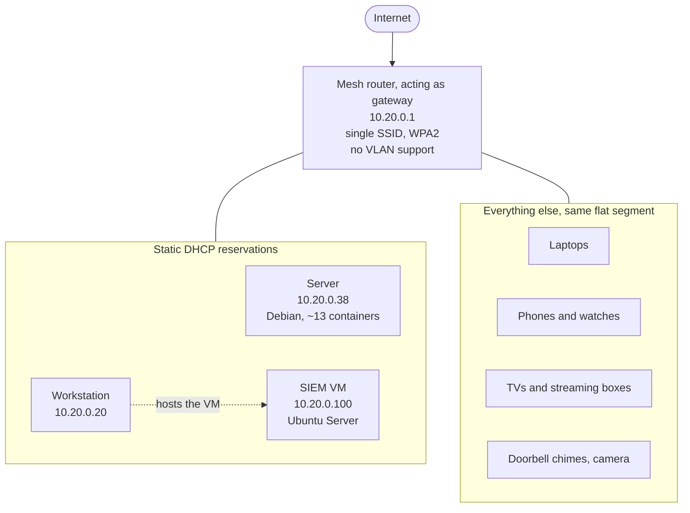
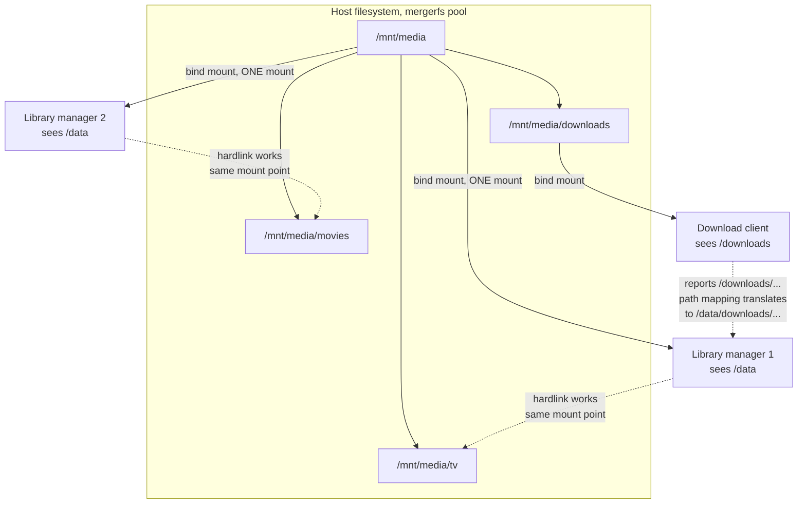
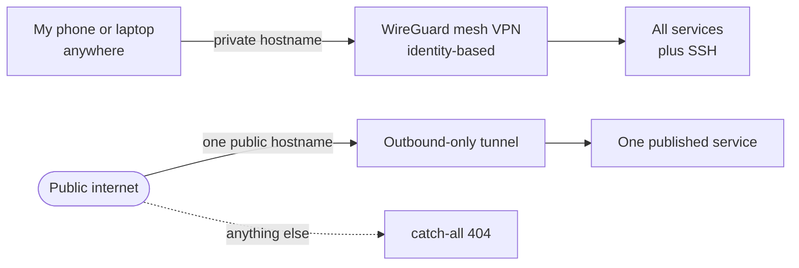

# Network

How the pieces connect. All addresses and names here are illustrative, not my
real ones, but the shape is accurate.

GitHub renders these diagrams directly.

---

## Topology

One flat network. Seventeen devices. Nothing forwarded on the router.



The three machines that other things depend on have reserved addresses. Before I
set those, my SIEM VM's address drifted and my documentation was wrong for weeks
without anyone noticing, including me.

**The weakness:** the camera and the doorbell chimes share a segment with the
server and the SIEM. Fixing that needs a VLAN-capable router. Mine has none, so
it's a hardware purchase, not a config change. It's on the list.

---

## How the containers see storage

This is the diagram I'd want if an import started misbehaving.



The library managers get **one** mount containing both the downloads and the
library, because hardlinks only work inside a single mount point. Mount them
separately and the applications quietly fall back to copying, which doubles disk
usage and stops the file being seeded.

The download client keeps its own narrower mount on purpose. It doesn't need
hardlinks, and giving it access only to the downloads directory limits what it
can write to. A path mapping in the library managers reconciles the two views.

---

## Getting in from outside



- **No ports forwarded.** Nothing listens on my home IP.
- The tunnel is established outward from the server, so it opens no inbound hole.
- Private addresses only resolve on the home network. From outside I use the
  VPN's own hostname, because I haven't advertised my LAN subnet to the VPN.
- SSH is key-only on the local network, and identity-based over the VPN.

---

## Re-checking this

Documentation goes stale quietly. When something changes, read it off the system
rather than editing from memory:

```bash
# gateway and subnet
ip route
ip -4 addr show

# what a container can actually see
docker inspect -f '{{range .Mounts}}{{.Source}} => {{.Destination}}{{println}}{{end}}' <name>

# whether hardlinks are actually working
find /path/to/library -name "*.mkv" | head -5 | xargs stat -c "nlink=%h %n"
```

That last one is worth running if you have a setup like this. If every file shows
`nlink=1`, your hardlinks have never worked and you're storing everything twice.
